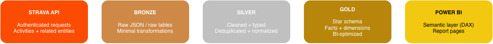
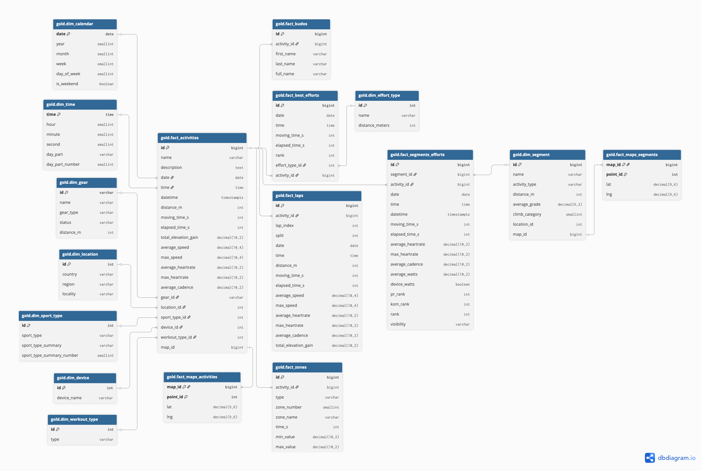

# 🏃‍♂️ Strava Analytics - Python + PostgreSQL + Power BI Project

📎 [**View Interactive Dashboard**](https://app.powerbi.com/view?r=eyJrIjoiNTdiMWRkOGYtNGE0Ny00YmI5LWJiYzAtYWYxZGQ2MmFmMmM0IiwidCI6IjY0YmU5OWY5LTI2N2MtNDIxMS1iMDlhLTQ0YmZlNjYyMzY0MCJ9&pageName=b48096df7ec0b97d2d07)

## ⚡ Project at a Glance

* **End-to-end analytics project**: **Strava API → PostgreSQL (Bronze/Silver/Gold) → star schema → Power BI**.
* Reliable ingestion with **incremental sync**, **API rate-limit handling**, and **retry/backoff** strategy.
* **Medallion architecture** for clean separation of concerns: **Bronze** (raw), **Silver** (cleaned/normalized), **Gold** (analytics-ready).
* BI-friendly modeling with **star schema**, clearly defined **grain** for fact tables, and consistent relationships to dimensions.
* **Power BI report** focused on training insights (distance, time, elevation, pace), enhanced with **drillthrough** and UX patterns (navigation, KPI toggles).
* Advanced **DAX** measures: modular design, **dynamic titles**, filter-aware KPIs, and time-based comparisons.
* Data quality fixes such as **reverse geocoding** to enrich/standardize locations when source data is incomplete or inconsistent.

## 📚 Table of Contents

- [⚡ Project at a Glance](#-project-at-a-glance)
- [🧠 Project Summary](#-project-summary)
- [🏗️ Architecture Diagrams](#️-architecture-diagrams)
  - [Pipeline](#pipeline)
  - [Gold Layer Schema](#gold-layer-schema)
- [🐍 Python ETL Pipeline](#-python-etl-pipeline)
  - [API Ingestion & Bronze Layer](#api-ingestion--bronze-layer)
  - [Silver Layer](#silver-layer)
  - [Gold Layer](#gold-layer)
- [📊 Power BI Reporting & Analytics](#-power-bi-reporting--analytics)
  - [Data Model Overview](#data-model-overview)
  - [Power BI Dashboard Overview](#power-bi-dashboard-overview)
  - [Custom Power BI Elements](#custom-power-bi-elements)
  - [DAX Measures](#dax-measures)
  - [DAX user-defined functions (UDFs)](#dax-user-defined-functions-udfs)
- [⚖️ Decisions & Trade-offs](#️-decisions--trade-offs)
- [📚 Creator Resources & Inspiration](#-creator-resources--inspiration)

## 🧠 Project Summary

**Strava Analytics** is a personal end-to-end analytics platform built on top of my **private Strava data**, enriched with **publicly available non-personal Strava information** (e.g., segment metadata). I created it to fill gaps in the native Strava app—such as quickly answering basic questions like **“How many kilometers did I run this year?”**—and to explore training history with deeper, customizable analysis.

The project implements a full **Medallion (Bronze/Silver/Gold) architecture** in **PostgreSQL**, powered by a **Python ETL pipeline** and topped with an interactive **Power BI** report.

* **Bronze (ingestion):** Reliable Strava API extraction with OAuth2 authentication, incremental sync, rate-limit handling, and auditable storage (including JSONB for nested payloads).
* **Silver (curation):** Transformation of raw payloads into clean relational tables with consistent grains/keys, plus practical enrichments—most importantly a **standardized location dimension via reverse geocoding**, introduced because Strava removed activity-level location fields and segment locations were inconsistent.
* **Gold (modeling):** An analytics-ready **star schema** designed for BI performance, centered on a 1-row-per-activity fact table and supporting dimensions/fact tables for deeper drillthrough (laps, efforts, zones, kudos, and map geometry).

On top of the Gold layer, the **Power BI dashboard** turns the dataset into an interactive training analytics experience: activity exploration, yearly summaries, gear tracking, training intensity analysis, segment/Local Legend views, and “year in review” storytelling—supported by a structured semantic model, reusable DAX patterns, and custom UX elements to make the report feel more like an app than a static BI file.

---

## 🏗️ Architecture Diagrams

### Pipeline

**Flow:** Strava API → Bronze → Silver → Gold → Power BI

* **Strava API**: activities + related entities pulled via authenticated requests
* **Bronze**: raw JSON/raw tables (minimal transformations)
* **Silver**: cleaned, typed, deduplicated, normalized tables
* **Gold**: star schema (facts + dimensions) optimized for BI/reporting
* **Power BI**: semantic layer (DAX) + report pages

### Gold Layer Schema

**Facts (transactional tables):**

* **`gold.fact_activities`** *(grain: **1 row per activity**)* — the central fact table powering most KPIs and trends.
* **`gold.fact_best_efforts`** *(grain: **1 row per best effort per activity**)* — PR/best-effort performances (e.g., 1 km / 5 km / 10 km).
* **`gold.fact_segments_efforts`** *(grain: **1 row per segment effort per activity**)* — efforts on Strava segments linked to both activity and segment.
* **`gold.fact_laps`** *(grain: **1 row per lap/split per activity**)* — laps/splits for pacing analysis.
* **`gold.fact_zones`** *(grain: **1 row per zone per activity per type**)* — time in zones (pace/HR).
* **`gold.fact_kudos`** *(grain: **1 row per kudos giver per activity**)* — social interactions.
* **`gold.fact_maps_activities`** *(grain: **1 row per map point per activity map**)* — activity geometry (lat/lng points).
* **`gold.fact_maps_segments`** *(grain: **1 row per map point per segment map**)* — segment geometry (lat/lng points).

**Dimensions (descriptive tables):**

* **`gold.dim_calendar`** — date attributes and hierarchies for **time intelligence**.
* **`gold.dim_time`** — time-of-day attributes (hour/min/sec) and **day parts** (morning/afternoon/evening).
* **`gold.dim_location`** — geographic hierarchy (**Country → Region → Locality**).
* **`gold.dim_gear`** — shoes/bikes/gear metadata and lifetime distance.
* **`gold.dim_device`** — recording device metadata (watch/bike computer/phone).
* **`gold.dim_workout_type`** — workout classification (e.g., races vs training runs).
* **`gold.dim_sport_type`** — sport types and summary categories.
* **`gold.dim_effort_type`** — best-effort definitions (distance/type).
* **`gold.dim_segment`** — segment metadata (distance, grade, category, map link, location reference).

**Keys & relationships (high level):**

* **Primary keys (PK):** each table has a unique identifier (e.g., `fact_activities.id`, `dim_location.id`, `dim_segment.id`).
* **Foreign keys (FK):**

  * `fact_activities` links to multiple dimensions via `date`, `time`, `gear_id`, `location_id`, `device_id`, `workout_type_id`, `sport_type_id`.
  * `fact_best_efforts`, `fact_laps`, `fact_kudos`, `fact_segments_efforts`, `fact_zones` link back to `fact_activities` via `activity_id`.
  * `fact_segments_efforts` links to `dim_segment` via `segment_id`.
  * Map tables link via `map_id` to `fact_activities` and `dim_segment`.

---

## 🐍 Python ETL Pipeline

This part implements an end-to-end **Python-based ETL pipeline** for Strava data using a **Medallion architecture** in **PostgreSQL**.

Data is ingested from the **Strava API** into a **Bronze layer** that prioritizes **reliability and auditability** (authenticated access, incremental sync patterns, and resilient persistence). It is then transformed into a **Silver layer** of **clean, relational, analysis-ready tables**, where nested API structures are normalized and key enrichments are applied—most notably a **standardized location dimension via reverse geocoding**, introduced because activity-level location fields were removed from the official API and segment locations were inconsistent. Finally, the **Gold layer** models the curated data into an **analytics-ready star schema** optimized for BI consumption (e.g., Power BI), with consistent grains, keys, and relationships that enable scalable reporting and time-based analysis.

---

### API Ingestion & Bronze Layer

This notebook implements the **Bronze ingestion layer**: **OAuth2-authenticated** extraction from the **Strava API v3** into **PostgreSQL**, designed for **replayable** and **rate-limit-aware** syncing.

* **Endpoints:** activities list + per-activity **details** , **kudos**, **zones**, and **running-only segment details** (to fit the strict **daily request budget** and match running-focused analysis).
* **Limits handled:** **100 req / 15 min** and **1,000 req / day** with **HTTP 429 + Retry-After**, **retry/backoff with jitter**, and **7–9s per-call delay** on per-activity requests.
* **Incremental strategy:** `activities` as a **snapshot overwrite**; `activities_details` refreshed for **missing IDs + last 30 days** to capture changes like **kudos_count**, **description**, and **workout/activity type**; writes use **staging + UPSERT**.
* **Storage:** minimal transformations, preserving selected nested fields as **JSONB** (e.g., `segment_efforts`, `splits`, `laps`, zone `distribution_buckets`).

➡️ For a detailed description of Bronze Layer, see the dedicated **API Ingestion & Bronze Layer** documentation [here](docs/python_bronze.md).

---

### Silver Layer 

This notebook builds the **Silver Layer** by transforming raw **Bronze Strava API payloads** into **clean, relational, analysis-ready tables** in **PostgreSQL**. While Bronze stores data in a **lossless and replayable** form, Silver focuses on **normalization, consistent grains/keys, and practical enrichments** required by the downstream **Gold layer** and **Power BI**.

What the notebook does:

* **Normalizes nested Strava structures into relational tables**
  Flattens arrays and objects from `bronze.activities_details` (e.g., **segment_efforts**, **laps**, **best_efforts**) and converts them into dedicated Silver tables with clear **row grain** and reusable keys.

* **Creates curated activity-level outputs**
  Produces a clean **1-row-per-activity** table as the main analytical base, with standardized column naming, typed fields, and safeguards for missing/empty payloads.

* **Zones as bucket-level facts**
  Explodes `distribution_buckets` from `bronze.activities_zones` into **bucket-level rows** (by zone type), enabling straightforward time-in-zone analysis without JSON parsing.

* **Reverse geocoding for a standardized location dimension**
  Because **activity location fields were removed from the official Strava API**, and segment locations were **inconsistent** (sometimes Polish, sometimes English), the notebook uses **start coordinates** to derive a **standardized city/region/country**. Results are **deduplicated and cached** in a reusable locations table to avoid repeated lookups and to keep the dimension consistent.

* **Maps: polylines → point-level geometry**
  Decodes Strava polylines into **ordered lat/lng points** (1 row per point), creating a reusable geometry dataset for spatial visuals and route-based analysis.

* **Deterministic persistence (full refresh)**
  Writes curated outputs into the **`silver` schema** using **full refresh (`replace`)**, keeping the layer reproducible and easy to validate.

➡️ For a detailed description of Silver Layer, see the dedicated **Silver Layer** documentation [here](docs/python_silver.md).

---

### Gold Layer

The **Gold Layer** turns curated **Silver** data into an **analytics-ready star schema** in **PostgreSQL**, designed for direct consumption by **Power BI**.

At the center is **`gold fact_activities`** (**1 row per activity**), linked to key **dimension tables** such as **calendar/time**, **sport & workout type**, **gear**, **device**, **location** (based on Silver reverse geocoding), and **segments / effort types**.

Additional **fact tables** capture detailed grains for analysis and drillthrough: **laps**, **best efforts**, **segment efforts**, **training zones**, **kudos**, and **map geometry** (activity + segment polylines stored as point-level tables for spatial visuals).

The result is a stable, BI-friendly layer with **consistent grains, keys, and relationships**, enabling time intelligence, segment analytics, gear tracking, intensity analysis, and map-based reporting without extra modeling effort in the BI tool.

➡️ For a detailed description of Gold Layer, see the dedicated **Gold Layer** documentation [here](docs/python_gold.md).

## 📊 Power BI Reporting & Analytics

This project includes an end-to-end **Power BI report** built on top of the **Gold layer** in PostgreSQL, turning raw Strava exports into an interactive **training analytics app**. The model follows a clean **star schema** with a rich **DAX layer**, **helper tables** and **user-defined functions (UDFs)** that power **dynamic slicers**, **metric toggles**, **time-intelligence** and storytelling features such as **yearly rewinds**, **training load** and **segment / Local Legend** analysis. Custom **UX patterns** (collapsible navigation, metric/period toggles, pop-ups, Deneb visuals) make the report feel closer to a modern **web dashboard** than a standard Power BI file.

---

### Data Model Overview

The Power BI model follows a **star schema** centered on the **`gold fact_activities`** table, which stores individual **Strava activities** (runs, rides, walks, etc.). This **core fact table** is linked to a set of **dimension tables** for **date** (**`gold dim_calendar`**), **time of day** (**`gold dim_time`**), **sport type** (**`gold dim_sport_type`**), **workout type** (**`gold dim_workout_type`**), **gear** (**`gold dim_gear`**), **location** (**`gold dim_location`**), **device** (**`gold dim_device`**) and **segments / effort types** (**`gold dim_segment`**, **`gold dim_effort_type`**).

Additional **fact tables** – **`gold fact_best_efforts`**, **`gold fact_laps`**, **`gold fact_segments_efforts`**, **`gold fact_zones`**, **`gold fact_kudos`**, and map tables (**`gold fact_maps_activities`**, **`gold fact_maps_segments`**) – capture **best performances**, **laps/splits**, **segment efforts**, **time in training zones**, **social interactions** and **GPS geometry** for routes and segments.

All KPIs and advanced logic are implemented in a **measure-only table** (**`Measures Table`**) supported by small **helper tables** (**`SummaryType`**, **`Training Zones Time Intelligence`**) that drive **dynamic slicers**, **metric switching** and **time-intelligence** scenarios used across the dashboards.

➡️ For a detailed description of data model, see the dedicated **Data Model** documentation [here](docs/power_bi_data_model.md).

---

### Power BI Dashboard Overview

The **Power BI report** sits on top of the **Gold** layer in PostgreSQL and gives a complete view of my **Strava training history**.

The pages are organized around key questions a Strava power user might ask:

- **Home** – high-level **summary of the last weeks** and lifetime KPIs: total distance, time, calories and active days, plus weekly distance and **sport-type breakdown**.  
- **All Activities** – interactive **activity log** for all sports with rich filtering (date, sport, workout type, gear, location) and detailed metrics for each workout.  
- **Running Activities** – focused view on **running-only data**, with filters for workout type, gear, location and device, and **drillthrough** to detailed activity pages.  
- **Gear** – analytics for **shoes and bikes**: usage over time, total distance, pace and status (active/retired), helping to track wear and gear lifecycle.  
- **Local Legends & Segments** – tools for **segment-based analysis** and **Local Legend** chasing: segments where I am close to the title, my current titles and drillthrough views for segment details and effort history.  
- **Training Intensity** – view of **effort and heart-rate zones**: time in each zone, weekly effort vs rolling average and recent high-effort activities.  
- **Yearly Summary** – long-term **year-over-year comparison** of time, distance, activity count and effort, showing stronger and weaker seasons.  
- **Period Summary** – analysis of **when** I train: heatmaps by year/month and by day of week/day part, plus average monthly and daily training time.  
- **Rewind** – a **“year in review”** experience comparing two years side by side: total time, top sports, days active, longest streaks and top locations/kudoers.

➡️ A detailed page-by-page description can be found [here](docs/power_bi_dashboard.md).

---

### Custom Power BI Elements

To make the report feel more like a **web app** than a standard Power BI report, I implemented several custom UX patterns using only **native features** (bookmarks, buttons, field parameters, DAX) plus one **Deneb** visual:

- **Collapsible navigation menu** – icon-only sidebar that can expand into a labelled menu via **bookmarks**, replacing default page tabs.  
- **Metric toggles with field parameters** – tab-like buttons that switch charts between **Time / Distance / Count / Effort** without duplicating visuals.  
- **Period toggles for Training Intensity** – pre-defined time windows (**7D, 1M, 3M, 6M, YTD, 1Y**) controlled by bookmarks and measures, mimicking training load dashboards from sports apps.  
- **Informational pop-ups for Strava concepts** – modal-style pop-ups opened from **help buttons** next to key visuals, explaining terms like **Segments**, **Local Legend** and **Relative Effort** using dedicated pages and bookmarks.  
- **Custom Deneb lap visuals** – Strava-like charts with **variable-width bars** that encode lap distance, pace and heart-rate zones for detailed workout analysis.

➡️ Detailed descriptions, screenshots and Vega-Lite specs are available [here](docs/power_bi_custom_elements.md).

---

### DAX Measures

The report uses a **rich DAX layer**, but it is built almost entirely on **standard DAX functions** such as **`SUM`**, **`AVERAGE`**, **`DISTINCTCOUNT`**, **`DIVIDE`**, **`CALCULATE`**, **`FILTER`**, **`DATESINPERIOD`**, **`SELECTEDVALUE`**, **`SWITCH`**, **`IF`**, **`FORMAT`** and **`LOOKUPVALUE`**.

At a high level, the measures fall into a few main groups:

* **Core totals & averages** – standard aggregations for **distance**, **time**, **Relative Effort**, **calories**, **activities** and **days active**, with both **numeric** and **formatted text** variants for cards and tooltips.
* **Time intelligence & comparisons** – rolling windows and period logic (7D / 1M / 3M / 6M / YTD / 1Y) to compare **time**, **distance**, **effort** and **time in zones** across weeks, months and years.
* **Training load & time-in-zone** – measures that summarise **Relative Effort**, derive a **3-week training baseline**, classify each week into **intensity bands**, and track **Zone 2 share** over configurable time windows.
* **Field-parameter style toggles** – a single set of visuals can switch between **Time / Distance / Effort / Activities** using helper tables and `SELECTEDVALUE` + `SWITCH`, with fully dynamic **titles**, **labels** and **heatmaps**.
* **Rewind & storytelling metrics** – “year in review” measures for **longest streak**, **top day of week**, **top part of day**, **location rank**, and **high-level summaries** (e.g. distance ≈ **number of Wroclaw–Paris trips**).
* **Segments, KOM & Local Legend** – logic to count **segment efforts in the last 90 days**, compute **efforts to Local Legend**, highlight **PR attempts** and show **top segment** details.
* **Gear & activity metadata** – lookups that translate IDs into friendly **device**, **gear**, **workout type** and **location** names, plus gear-level stats such as **average pace/speed** and **cumulative distance**.
* **UX helpers** – icon/image measures, explanatory text blocks and empty-state placeholders that make the report feel more like an **interactive training app** than a static dashboard.

➡️ For a detailed description of individual measures and patterns, see the dedicated **DAX Measures** documentation [here](docs/power_bi_measures.md).

---

### DAX user-defined functions (UDFs)

The project makes extensive use of **Power BI DAX user-defined functions** to keep the model **modular**, **reusable** and **easy to maintain**. Instead of repeating complex logic across multiple measures, I encapsulated it into parameterised functions and reused them throughout the report.

At a high level, these UDFs cover:

* **Aggregations over time** – functions that calculate **average totals per active day/month** and drive **daily/monthly heatmaps** for activities, distance, time and effort.
* **Formatting & units** – helpers to convert **seconds to readable durations**, **meters to km text**, parse **result strings to seconds**, and compute **pace/speed** depending on the sport (min/km, min/100m, min/500m, km/h).
* **UI & icons** – functions that return **icon URLs** for **sports**, **gear types/status**, **PR/segment ranks**, and **color codes** for **pace/heart-rate zones**, used in buttons, cards and heatmap visuals.
* **Training load & zones** – time-intelligence helpers that calculate **time in Zone 2** over rolling periods (7D, 1M, 3M, 6M, YTD, 1Y) and compare it with **previous periods**.
* **Calendar & streak logic** – logic to compute the **longest streak of consecutive active days** together with the **date range** of that streak.
* **Yearly summary engines** – two central functions (`YearlyTotals` and `YearlyRunningTotals`) that return **current**, **previous**, **difference** and **YTD** values for **time, distance, effort and activities**, powering the **Yearly Summary** and **Running Rewind** pages.

Thanks to these UDFs, most “final” measures in the report become thin wrappers around **shared building blocks**, which improves **readability**, **consistency** and makes it much easier to **extend** the model with new metrics in the future.

➡️ For a detailed description of individual functions, see the dedicated **DAX user-defined functions (UDFs)** documentation [here](docs/power_bi_functions.md).

## ⚖️ Decisions & Trade-offs

- **Medallion architecture (Bronze / Silver / Gold).**  
  I separated **raw ingestion** from **cleaned** and **analytics-ready** layers to keep transformations modular and easier to debug.  
  **Trade-off:** more pipeline steps and tables to maintain, but clearer ownership of logic and simpler iteration.

- **Incremental sync + resilience for Strava API limits.**  
  Strava API constraints (rate limits, transient errors) required **incremental loading** and **retry/backoff** to make refreshes reliable.  
  **Trade-off:** added orchestration complexity and state management, but faster refresh cycles and fewer failed runs.

- **Reverse geocoding to fix inconsistent location data.**  
  Activity locations can be missing or inconsistent, so I enriched them via **reverse geocoding** to enable stable **Country → Region → City** analysis.  
  **Trade-off:** extra requests/time (and potentially cost), so enrichment is designed to be **cached/reused** instead of recomputed every run.

- **Segment scope limited to running activities.**  
  I intentionally ingest segment efforts only for **running** activities instead of all sports. Cycling activities can generate a **large volume** of segment efforts that I complete **sporadically**, which adds little analytical value while consuming **API requests** and increasing processing time.  
  **Trade-off:** the model is less complete for cycling segment analysis, but the pipeline is more efficient and the report can focus on **high-signal running segments** and dedicated **drillthrough** pages.

- **Star schema in Gold for BI performance and usability.**  
  The **Gold** layer is modeled as a **star schema** (facts + dimensions) to optimize **Power BI performance**, simplify relationships, and keep measures readable.  
  **Trade-off:** stricter modeling and more tables, but better query performance and a more intuitive reporting layer.

- **DAX as the semantic layer (not in SQL).**  
  I kept part of the business logic in **DAX** to support interactive reporting (dynamic KPIs, context-aware calculations, time intelligence).  
  **Trade-off:** requires disciplined measure design and performance checks (filter context, cardinality), but enables faster iteration and richer UX in the report.

- **Geometry stored separately (maps facts).**  
  Map coordinates/polylines are stored in dedicated tables (`fact_maps_*`) to keep the core fact tables lightweight and avoid bloating the model.  
  **Trade-off:** more joins when rendering maps, but improved overall model performance and cleaner separation of heavy spatial data.

## 📚 Creator Resources & Inspiration

The following creator-made materials helped shape parts of this project (ideas, approaches, and implementation patterns):

- **YouTube (video):** “Strava API + data analysis”  
  https://www.youtube.com/watch?v=DNJfUPfSZpY

- **Towards Data Science (article):** “Using the Strava API and Pandas to Explore Your Activity Data”  
  https://towardsdatascience.com/using-the-strava-api-and-pandas-to-explore-your-activity-data-d94901d9bfde/

- **GitHub (project):** `statistics-for-strava` (reference implementation / inspiration)  
  https://github.com/robiningelbrecht/statistics-for-strava

> Note: This project is an original end-to-end implementation (Python → PostgreSQL medallion → Gold star schema → Power BI). The links above are included for attribution and as learning references.
