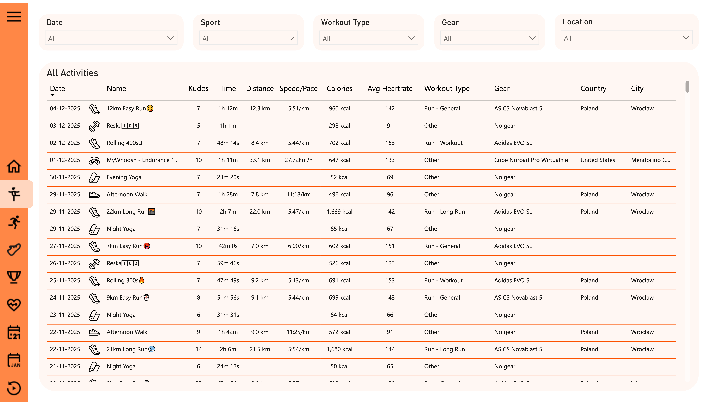
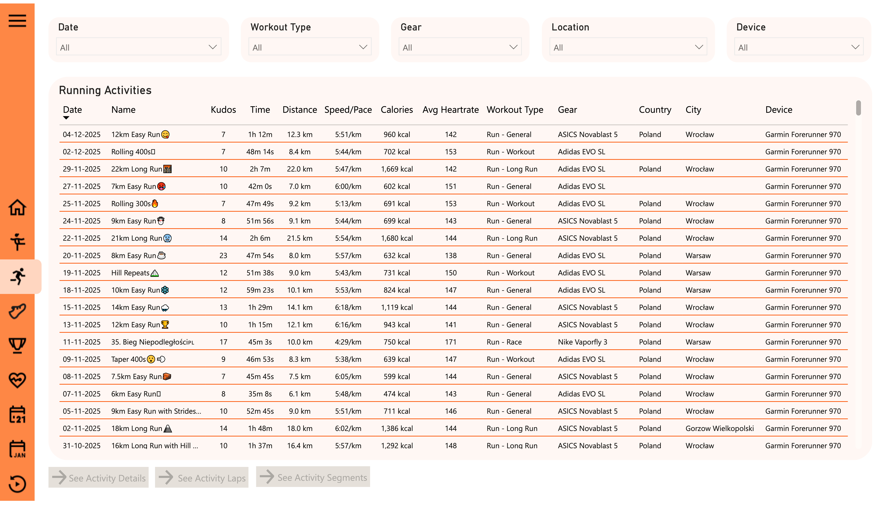
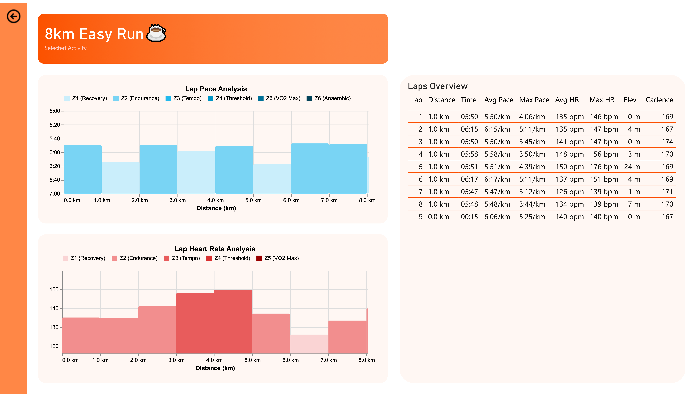

## 4. Power BI Dashboard Overview

### Home

High-level **overview page** showing:

- **Last 4 weeks of activities** in a detailed table (sport type, distance, pace, calories, etc.).  
- Key **lifetime KPIs** (active days, total distance, total training time, total calories) with intuitive equivalents  
  (e.g. years of daily activity, number of Wrocław–Paris trips).  
- **Total weekly distance** chart with a **sport type toggle** (Ride / Run / Swim).  
- **Weekly sport type breakdown** to show how my training time is distributed between different sports.

### All Activities

A detailed **activity log** for all sports:

- Full **table of activities** with metrics such as kudos, time, distance, pace/speed, calories, average heart rate, gear and location.  
- **Top slicers** for **date, sport, workout type, gear and location**, turning this page into an interactive activity explorer.

### Running Activities & Activity Details (Drillthrough)

A focused view on **running only** plus drillthrough pages for a selected run:

- The same detailed **activity table** as on *All Activities*, but pre-filtered to **running workouts**.  
- Slicers for **date, workout type, gear, location and device**, which turn this page into a control center for analysing runs.  
- From any selected activity, the user can **drill through** to three **Running Activity Details** pages:

  1. **Activity Details**  
  
     - Large **activity header** with name, distance, time, average pace, elevation gain, calories and average heart rate.  
     - Map visual showing the **GPS route** and **location** of the workout.  
     - Cards with **gear**, **device** and **workout type** used for that run.  
     - **Time spent by heart-rate zone** and **time spent by pace zone**, allowing quick assessment of intensity vs target zone.  
     - **Best efforts** table (e.g. 400m, 1K, 5K, 10K) and a **kudos list** with all athletes who reacted to the activity.

  2. **Laps Analysis**  
  
     - **Lap pace analysis** chart: lap-by-lap pace broken down by **pace zones**, helping to see how stable the pacing was over the whole run.  
     - **Lap heart-rate analysis** chart: average heart rate per lap and corresponding HR zones.  
     - **Laps overview table** with distance, lap time, average and max pace, average and max heart rate, elevation change and cadence for each lap.

  3. **Segments**  
     - Table of all **Strava segments** included in the activity with **time, distance, pace, elevation difference, heart rate and cadence**.  
     - Allows a quick check of how this particular run contributed to performance on key segments and Local Legend attempts.

### Gear

Analysis of my **shoes and bikes**:

- **Gear stats table**: total activities, distance, average distance, total time, average pace/speed, status (active/retired), number of races, first and last usage.  
- **Distance over time per gear** line chart to track wear and usage of each pair of shoes or bike over the years.

### Local Legends & Segment Details (Drillthrough)

A page dedicated to **Strava Local Legend** mechanics, with drillthrough for segment deep dives:

- Table **“Segments – Efforts Missing to Become Local Legend”** showing current local legend, their efforts, my efforts and  
  **how many efforts are missing** for me to take the title.  
- Filters for **local legend name, segment location and distance range**.  
- Table **“Your Local Legends Titles”** listing segments where I am already the Local Legend.  

From here and from other segment-related views, the report exposes a dedicated **Segment Details** drillthrough with two pages for a selected segment:

1. **Segment Overview**  
   - Large **segment header** with name and location (city, region, country).  
   - Key metrics: **distance**, **elevation gain**, **average grade** and a small **elevation profile**.  
   - **Map visual** showing the exact route of the segment.  
   - **Fastest times** section with course records (e.g. CR overall / CR men) and **time & pace difference vs. my best attempt**.  
   - **Your stats** card with total number of **segment efforts**, **PR time**, **PR pace** and **PR date**.  
   - **Most Efforts** card showing the athlete with the highest number of efforts in the last 90 days  
     (the current **Local Legend**) and their effort count.  
   - KPI tile with **“Your Efforts in the Last 90 Days”**, summarising how active I am on this segment.

2. **Segment Efforts History**  
   - **Recent efforts chart** with segment times for the last attempts and a reference **“Best Effort”** line,  
     making it easy to see progress or regression over time.  
   - **All efforts table** listing every attempt on this segment with **datetime, time, pace, average/max heart rate, cadence**  
     and the **parent activity name**.  
   - From this page, the user can drill down further to **Activity Details** for the selected effort.

### Training Intensity

Focus on **effort and heart-rate zones**:

- KPI tile with **% of time in Zone 2** and comparison vs previous period.  
- **Weekly effort vs 3-week average** chart to monitor sudden spikes or drops in training load.  
- Breakdown of time spent in **Z1–Z5 zones** and **daily effort distribution** by day of week.  
- Detailed table of recent activities with **relative effort**.

### Yearly Summary

Long-term **year-over-year** perspective:

- **Rolling yearly totals** and **monthly totals** for time, distance, count and effort.  
- **Yearly comparison table** showing total values and **year-over-year changes**, helping to spot strong and weak seasons.

### Period Summary

More detailed **period analysis**:

- **Heatmap** of total monthly time by **year and month**.  
- **Average monthly time** by year/month to compare training habits across seasons.  
- **Average daily time** by **day of week** and **day part** (morning, lunch, afternoon, evening), showing when I typically train.

### Rewind

“**Year in review**” section with **two pages**:

**Page 1 – High-level yearly comparison**

- Side-by-side comparison of **two selected years** (current vs comparison year).  
- Monthly bars for **total time** and a breakdown by **top sports**.  
- **Total days active** per year and circular indicators showing **activity days per month**, giving a quick snapshot of consistency.

**Page 2 – Streaks, kudos and locations**

- **Longest streak** of consecutive active days for each year, including **streak length** and **start/end dates**.  
- Cards with **top day of week**, **top part of the day** and **average activity time**, showing when I am most likely to train.  
- **Top kudoers** bar charts highlighting friends who interact with my activities the most.  
- **Top segment** card with segment name, number of efforts and a **map** of the segment.  
- **Top locations** tables listing the most frequent cities and countries where I trained in each year.

