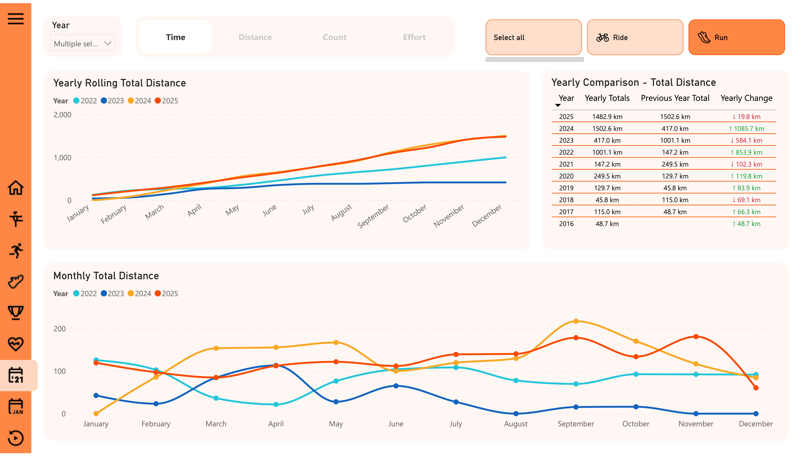
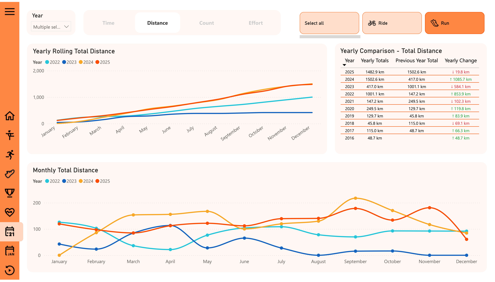
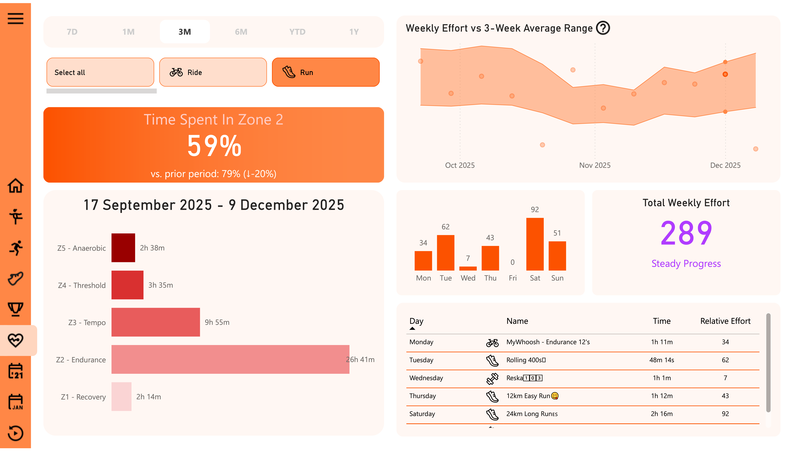
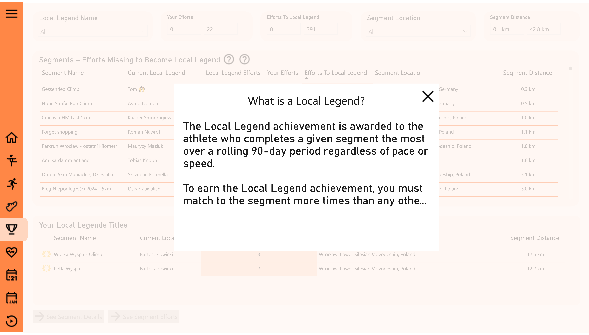

## Custom Power BI Elements

This report uses several **custom UX patterns** built directly in **Power BI**, without external custom visuals.  
The goal is to make the report feel more like a **web app** than a standard tabbed report.

### Collapsible navigation menu (bookmarks)

Instead of default **page tabs**, the report uses a **collapsible left-hand navigation** built with **bookmarks**:

- A narrow **icon-only bar** is always visible (Home, Activities, Gear, Local Legends, Training Intensity, etc.), keeping the canvas clean.  
- Clicking the **menu (hamburger) button** opens a **full navigation panel** with **icons and page names**, making it easier for new users to understand the structure.  
- The menu uses **bookmarks + Selection pane** to toggle between **collapsed** and **expanded** states and to highlight the **currently active page**.  
- Each icon/label is a **button with page navigation action**, so the experience feels like an in-app sidebar rather than standard Power BI tabs.

This pattern provides a **Strava-like layout**:  
compact by default, but with an optional expanded menu for users who prefer **explicit labels** instead of just icons.

### Metric toggle with field parameters & bookmarks

On the **Yearly Summary** and **Period Summary** pages the main charts are driven by a single **field parameter** that can switch between four metrics:

- **Time**
- **Distance**
- **Count**
- **Effort**

Instead of using a standard slicer, the report uses a row of **button-like tabs** (Time / Distance / Count / Effort).  
Each tab triggers a **bookmark** that:

- updates the **field parameter** selection,  
- changes the **active tab styling** (highlighted background),  
- keeps the underlying visuals, but swaps the **measure being plotted**.

Thanks to this pattern, one layout can show **four different perspectives** on the same data without duplicating pages or visuals, and the user experiences it as a clean, Strava-like **metric toggle**.

### Period toggle for Training Intensity (bookmarks + measures)

On the **Training Intensity** page the user can switch between predefined **time windows**:

**7D · 1M · 3M · 6M · YTD · 1Y**

The selector is designed as a row of **tabs** rather than a standard slicer.  
Each tab is a **button** connected to a **bookmark**, which:

- updates the underlying **period selection measure** (e.g. last 7 days, last 3 months, year-to-date),
- highlights the **active tab** with a different background and bold label, imitating a web/app toggle.

This pattern allows the page to behave like a **training load dashboard** found in sports platforms, while still being implemented using only **native Power BI features** (buttons, bookmarks and DAX measures).

### Custom Deneb visuals for lap pace & heart rate

For the **Lap Pace Analysis** and **Lap Heart Rate Analysis** on the running activity detail pages I use a custom visual built with **Deneb (Vega-Lite)** instead of standard Power BI bar charts.

Standard column charts in Power BI do **not** support **variable bar width**, which is crucial when analysing laps of different lengths.  
In the Deneb visuals:

- each lap is drawn as a **rectangle whose width reflects lap distance** (start and end km on the x-axis),  
- the **y-axis** encodes **pace (min/km)** or **average heart rate (bpm)**,  
- the **color** shows the corresponding **pace / heart-rate zone**,  
- tooltips expose lap index, pace/HR and exact **lap distance**.

Thanks to the custom bar width, I can immediately see **which parts of the workout were longer or shorter** and how intensity changed across the session – in a way that closely mirrors how **running workouts are presented on Strava** – while still staying fully inside **Power BI** using the **Deneb** visual.

### Informational pop-ups for Strava concepts

To make the report easier to use for people who are not familiar with **Strava** terminology, I added a set of **custom informational pop-ups**. Small **help buttons** (question-mark icons) are placed next to visuals that rely on domain concepts such as **Segments**, **Local Legend** or **Relative Effort**.  

Clicking a button opens a **modal-style pop-up** built with a dedicated report page and bookmarks. The background of the report is dimmed and a centred card displays:

- a clear **title** (e.g. *“What is a Local Legend?”*),  
- a short, plain-language **definition** of the concept,  
- an explanation of **how it is used or calculated** in this report,  
- a close icon to return to the main view.

These pop-ups act as an **in-report glossary**, reduce cognitive load, and help new users understand the metrics without leaving the dashboard or reading separate documentation.
